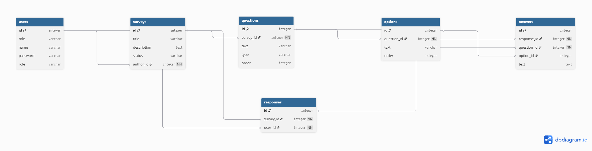

# Преддипломная практика — Survey API

Веб-программирование | 2026
Работу выполнила студетка группы 1ИСП-21 Пыхалова Татьяна Евгеньвна :)
---

## О проекте

**Survey API** — сервис опросов и голосований с аналитикой результатов.  
Пользователи могут быть авторами опросов (создают и управляют) или респондентами (проходят опросы).  
Сервис позволяет:

- Создавать, редактировать и публиковать опросы
- Добавлять вопросы с типами: одиночный выбор, множественный выбор, текст
- Устанавливать варианты ответов для вопросов с выбором
- Проходить опросы, отправлять ответы
- Анализировать результаты по каждому вопросу
- Экспортировать результаты в JSON

---

## ER-диаграмма

  
*(Ссылка на dbdiagram.io: [Survey API ER](https://dbdiagram.io/d/Pykhalova_survey-api-69a182cfa3f0aa31e14d2779))*

**Таблицы базы данных:**

- **users** — пользователи (авторы и респонденты)
- **surveys** — опросы
- **questions** — вопросы
- **options** — варианты ответов
- **responses** — прохождения опросов
- **answers** — ответы респондентов

---

## API-эндпоинты
**Почему я сделала эти эндпоинты:**
1. **Регистрация и авторизация:**  
```/register и /login``` — чтобы новые пользователи могли попасть в систему;  
```/logout``` и ```/me``` — чтобы контролировать сессию и получать свои данные.  

2. **Опросы:**  
```/api/surveys``` - CRUD *(Create, Read, Update, Delete)* для опросов: список, создание, детали, редактирование;  
```/publish``` и ```/close``` - отдельно, чтобы менять статус опроса (черновик - опубликован - закрыт).  
*(автор должен управлять опросами, но нельзя редактировать опубликованный опрос)*  

3. **Вопросы и варианты:**  
```/api/surveys/{id}/questions``` - добавление вопросов к конкретному опросу;  
```/api/questions/{id}``` - редактирование/удаление вопросов;  
```/api/questions/{id}/options``` - добавление вариантов ответов.  
*(вопросы и варианты привязаны к конкретному опросу, автор должен иметь возможность управлять ими)*  

4. **Прохождение опросов:**  
```/api/surveys/published``` - показать только опубликованные опросы;  
```/api/responses``` - отправка своих ответов на опрос;  
```/api/responses/{id}``` - просмотр своих ответов;  
*(респондент не должен видеть черновики и не может редактировать чужие опросы*)  

5. **Аналитика:**  
```/api/surveys/{id}/analytics``` - статистика по ответам.  
```/api/surveys/{id}/export``` - выгрузка результатов в JSON.  
*(сразу отвечу на вопрос ```Почему json?``` - потому что универсальный формат, легко читать и импортировать в инструменты для анализа)*  


### Аутентификация и пользователи

| Метод | URL | Роль | Описание |
|-------|-----|------|----------|
| POST  | /api/register | все | Регистрация пользователя |
| POST  | /api/login    | все | Вход в систему |
| POST  | /api/logout   | авторизованный | Выход из системы |
| GET   | /api/me       | авторизованный | Получить данные текущего пользователя |

### Опросы (Автор)

| Метод | URL | Роль | Описание |
|-------|-----|------|----------|
| GET   | /api/surveys          | автор | Список своих опросов |
| POST  | /api/surveys          | автор | Создать новый опрос |
| GET   | /api/surveys/{id}     | автор | Получить детали опроса |
| PATCH | /api/surveys/{id}     | автор | Обновить опрос (только черновик) |
| PATCH | /api/surveys/{id}/publish | автор | Опубликовать опрос |
| PATCH | /api/surveys/{id}/close   | автор | Закрыть опрос |

### Вопросы и варианты (Автор)

| Метод | URL | Роль | Описание |
|-------|-----|------|----------|
| POST  | /api/surveys/{id}/questions | автор | Добавить вопрос к опросу |
| PATCH | /api/questions/{id}         | автор | Изменить вопрос |
| DELETE| /api/questions/{id}         | автор | Удалить вопрос |
| POST  | /api/questions/{id}/options  | автор | Добавить вариант ответа |
| PATCH | /api/options/{id}           | автор | Изменить вариант ответа |
| DELETE| /api/options/{id}           | автор | Удалить вариант ответа |

### Прохождение опросов (Респондент)

| Метод | URL | Роль | Описание |
|-------|-----|------|----------|
| GET   | /api/surveys/published | респондент | Список доступных опросов |
| POST  | /api/responses          | респондент | Отправить ответы на опрос |
| GET   | /api/responses/{id}     | респондент | Просмотреть свои ответы |

### Аналитика (Автор)

| Метод | URL | Роль | Описание |
|-------|-----|------|----------|
| GET   | /api/surveys/{id}/analytics | автор | Статистика по респондентам и ответам |
| GET   | /api/surveys/{id}/export    | автор | Экспорт результатов в JSON |

---

##  И самое главное... Как запустить проект

1. Склонировать репозиторий и перейти в папку проекта:
```bash
git clone https://github.com/naomichkkka/practice-backend-2026/tree/dev
cd survey-api
```
2. Установить зависимости:
```bash
composer install
```
3. Настроить .env 
4. Запустить миграции:
```bash
php artisan migrate
```
5. Запустить локальный сервер

---
## Стек технологий:
- PHP — Laravel
- База данных — MySQL
